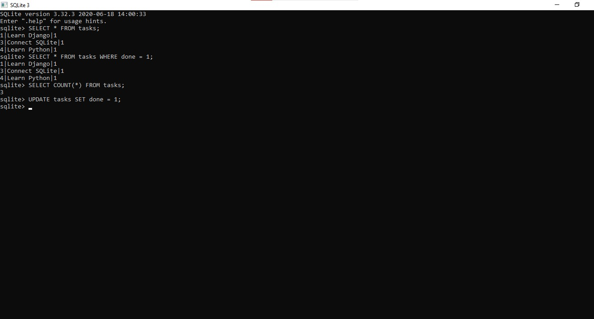

# Task Management CRUD API

A simple CRUD API built with Python, Flask, and SQLite.
## Features
- Create tasks
- Read all tasks
- Read a single task
- Update tasks
- Delete tasks
- Persistent data using SQLite
- Swagger API documentation

## Technologies

- Python
- Flask
- SQLite
- Flasgger

## Database

SQLite is used because it is lightweight, requires no separate database server, and stores the database in a single file.

The database file is:

`tasks.db`

The `tasks` table contains:

- `id` — Integer primary key
- `title` — Task title
- `done` — Task completion status

## Database Screenshot



## How to Run

1. Clone the repository.
2. Open the project in PyCharm.
3. Install the required dependencies:

```bash
pip install -r requirements.txt

4. Run the application:

python app.py

5. Open Swagger:

http://127.0.0.1:5000/apidocs/

The SQLite database and tasks table are automatically created when the application starts.

SQL Query Example

SELECT * FROM tasks;

This query returns all tasks stored in the database.

Project Structure

CRUD_API/
│
├── app.py
├── database.py
├── tasks.db
├── requirements.txt
└── README.md


